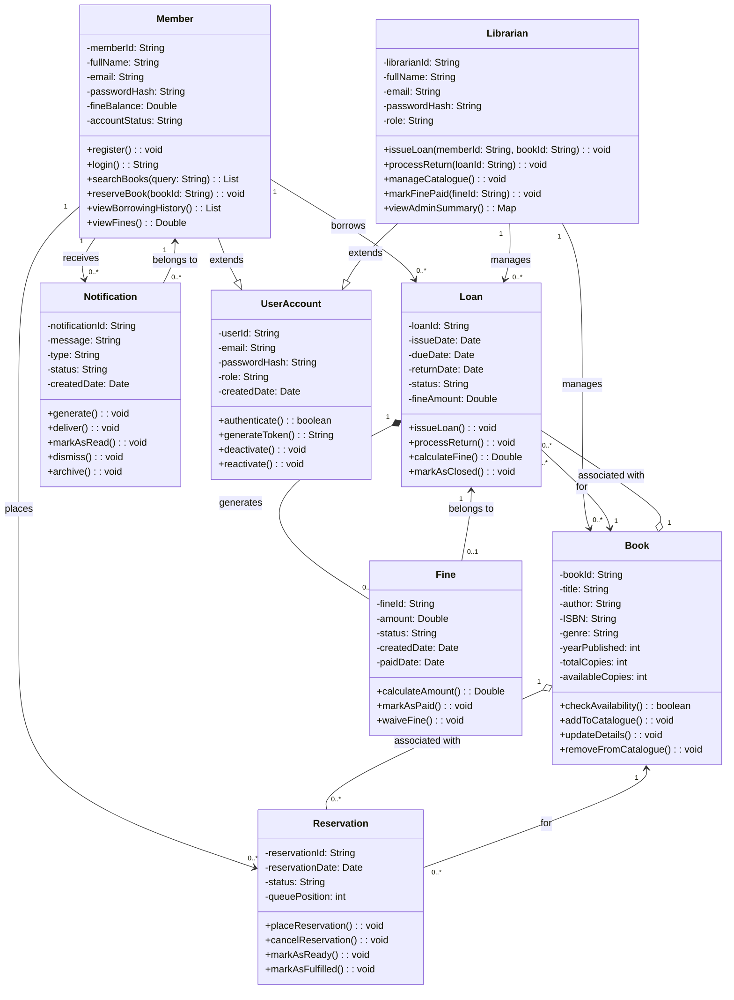
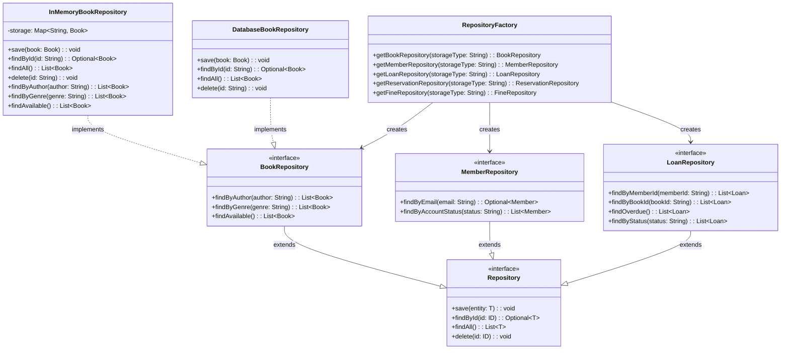

# CLASS-DIAGRAM.md — Smart Library Management System

---

## Class Diagram

Below is the class diagram that represents the full structure of the system, showing all classes, their attributes and methods, and the relationships between them including association, composition, and inheritance.

---

---

## Key Design Decisions

**Inheritance: UserAccount as a base class:**
Both Member and Librarian share common attributes like email, passwordHash, and role. Rather than duplicating these in both classes I created a UserAccount base class that both extend. This keeps the authentication logic in one place and makes it easier to add new user types in the future without changing existing classes.

**Composition: Loan and Fine:**
A Fine cannot exist without a Loan, if the loan is deleted then the fine has no meaning. This makes the relationship a composition rather than a simple association. The Fine is fully owned by the Loan that generated it.

**Aggregation: Book and Loan / Book and Reservation:**
A Book can exist without any active Loans or Reservations. When a loan is closed or a reservation is fulfilled the Book continues to exist independently. This makes these relationships aggregations rather than compositions.

**Separation of Member and Librarian:**
Even though both extend UserAccount, Member and Librarian have distinctly different methods. A Member can search and reserve books while a Librarian can issue loans and manage the catalogue. Keeping them as separate classes enforces the role-based access control I defined in FR-02 and makes the system easier to secure.

**Notification as a standalone class:**
Notifications could have been handled as simple messages, but making Notification a full class allows the system to track the status of each alert, archive them, and link them back to the member they belong to. This supports the state transitions defined in STATE-DIAGRAMS.md.

---

## Repository Layer Class Diagram

The diagram below shows the repository interfaces and implementations added in Assignment 11.

